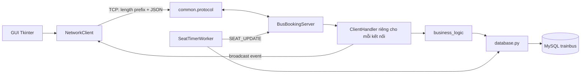
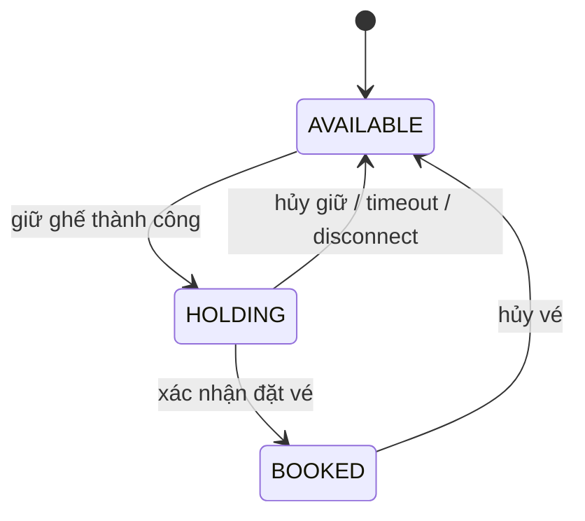

# Phân tích chi tiết Client - Server TrainBus

Tài liệu này mô tả hành vi theo mã nguồn hiện tại trong `client/`, `server/` và `common/`. Một số README, Dockerfile và cấu hình cũ chưa đồng bộ với code; các khác biệt đó được ghi riêng ở phần cuối.

## 1. Tổng quan kiến trúc

TrainBus là ứng dụng desktop viết bằng Python/Tkinter. Client và server trao đổi qua TCP Socket; server đọc/ghi MySQL. Client không truy cập database trực tiếp: mọi thao tác nghiệp vụ đi qua request/response JSON của server.



Các vai trò tài khoản được định nghĩa là `Customer`, `Driver`, `Staff`, `Admin`. Ứng dụng `run_client.py` dành cho Customer/Driver; giao diện Admin/Staff được mở riêng bằng `run_admin.py` trên máy server hoặc máy quản trị. Cả hai giao diện kết nối đến server ở `SERVER_HOST:SERVER_PORT` (mặc định `127.0.0.1:8888`); server lắng nghe trên `0.0.0.0:8888`.

## 2. Giao thức và cách trao đổi dữ liệu

TCP là luồng byte, không bảo toàn ranh giới từng lần gửi. [common/protocol.py](common/protocol.py) giải quyết việc này bằng framing:

```text
[4 byte unsigned integer, Big-Endian: độ dài payload][JSON UTF-8]
```

- `send_msg()` JSON-encode dictionary, thêm header độ dài rồi gửi đủ bằng `sendall()`.
- `recv_msg()` đọc chính xác 4 byte header, giải mã độ dài rồi đọc đủ payload. Mất kết nối/lỗi JSON trả về `None`.
- Mỗi request thường có trường `action`; phản hồi có `status` (`SUCCESS` hoặc `ERROR`) và dữ liệu tương ứng.
- Broadcast là message riêng có trường `event`, ví dụ `SEAT_UPDATE`, `NOTIFICATION`, `USER_STATUS` và các sự kiện cuộc gọi.
- Client không gắn request ID vào message. `NetworkClient.send_request()` khóa việc gửi và chờ response, còn luồng listener chuyển response vào queue. Vì vậy các request trên cùng một `NetworkClient` được xử lý tuần tự.

Ví dụ khái niệm:

```json
{"action":"GET_SEATS","trip_id":1,"token":"..."}
```

Phản hồi tương ứng:

```json
{"status":"SUCCESS","trip_id":1,"seats":{"A01":"AVAILABLE"}}
```

## 3. Luồng hoạt động tổng thể

1. Chạy `run_server.py`. Server khởi tạo database, chạy timer worker, bind TCP port và chờ kết nối.
2. Chạy `run_client.py`. `ClientApplication` tạo `NetworkClient`, mở cửa sổ đăng nhập và thử kết nối nền.
3. Khi đăng nhập, client gửi `LOGIN`; server kiểm tra tài khoản trong database, tạo session token và lưu socket online.
4. Client thường chỉ cho `Customer`/`Driver` vào giao diện đặt vé. Admin/Staff đăng nhập qua launcher quản trị riêng; client thường từ chối các role này.
5. Từng thao tác UI gọi API trên `NetworkClient`; server nhận request trong luồng `ClientHandler` riêng, gọi nghiệp vụ/database rồi gửi response.
6. Khi trạng thái dùng chung thay đổi, server gửi event đến các client liên quan. Listener phía client gọi callback và cập nhật Tkinter qua `root.after()`.
7. Khi client logout/ngắt kết nối, server dọn session, trạng thái online, ghế đang giữ và socket.

## 4. Các file phía Client

| File | Trách nhiệm và cách hoạt động |
| --- | --- |
| [client/client_main.py](client/client_main.py) | Entry point GUI `ClientApplication` dành cho Customer/Driver. Tạo Tk root và `NetworkClient`, mở màn hình đăng nhập/đặt vé, từ chối Admin/Staff và đóng kết nối khi thoát. |
| [client/network_client.py](client/network_client.py) | Lớp giao tiếp mạng. Tạo TCP socket; chạy listener và heartbeat nền; gửi request có token; đưa response vào queue; dispatch event qua callback; hỗ trợ thử kết nối lại. Các hàm như `login`, `get_trips`, `hold_seats`, `confirm_booking`, API admin và voice call ánh xạ thành action JSON. |
| [client/gui_login.py](client/gui_login.py) | Màn hình đăng nhập/đăng ký khách hàng và tài xế. Tự kết nối đến server, kiểm tra input cơ bản rồi gọi `NetworkClient.login()` hoặc `register()`. Server vẫn là nơi xác thực cuối cùng. |
| [client/gui_login_admin.py](client/gui_login_admin.py) | Màn hình đăng nhập riêng cho Admin/Staff, được mở bởi `run_admin.py`. |
| [client/gui_booking.py](client/gui_booking.py) | Giao diện đặt vé: tìm chuyến, tải sơ đồ ghế, chọn ghế, giữ chỗ, đếm ngược, hiển thị QR thanh toán và xác nhận đặt vé. Đăng ký callback nhận cập nhật ghế/thông báo/cuộc gọi. UI gọi `root.after()` khi callback từ listener cần đổi Tkinter. |
| [client/gui_history.py](client/gui_history.py) | Tải vé của tài khoản, hiển thị chi tiết/QR check-in, hủy vé và xuất biên lai. Việc hủy thực sự được server kiểm tra quyền sở hữu vé. |
| [client/gui_profile.py](client/gui_profile.py) | Đọc/sửa hồ sơ, đổi mật khẩu và hiển thị thống kê cá nhân thông qua các action của `NetworkClient`. |
| [client/gui_admin.py](client/gui_admin.py) | Giao diện quản trị: dashboard, danh sách người dùng/vé, người online, thông báo, thêm chuyến, quản lý xe, nhật ký. Chỉ launcher `run_admin.py` mở giao diện này. |
| [client/voice_call.py](client/voice_call.py) | Hộp thoại cuộc gọi đến/đi/đang kết nối, chấp nhận/từ chối/kết thúc và animation. Đây là UI/báo hiệu cuộc gọi; không thấy triển khai thu, mã hóa hay truyền luồng âm thanh trong file này. |

### Vai trò của `NetworkClient`

- Một socket được dùng cho cả request/response và event server gửi bất đồng bộ.
- `_listen_loop()` phân loại message: message có `event` gọi callback; các message còn lại vào `response_queue`.
- `send_lock` tuần tự hóa cả thao tác gửi lẫn chờ response trên cùng client để tránh lấy nhầm response giữa các lệnh đồng thời.
- Heartbeat gửi action `HEARTBEAT` theo chu kỳ 30 giây. Khi listener phát hiện mất kết nối, callback được gọi và cơ chế reconnect thử lại theo chu kỳ 3 giây.
- Token được tự thêm vào payload sau đăng nhập. Token tra session phía server, không phải dữ liệu user tự xác nhận.

## 5. Các file phía Server

| File | Trách nhiệm và cách hoạt động |
| --- | --- |
| [server/server_main.py](server/server_main.py) | `BusBookingServer`: khởi tạo database, bật `SeatTimerWorker`, tạo socket TCP, accept kết nối và tạo `ClientHandler` daemon cho từng socket. Quản lý tập socket và các hàm broadcast. |
| [server/client_handler.py](server/client_handler.py) | Vòng lặp nhận message từ một client, rẽ nhánh theo `action`, gọi business logic/database, gửi response. Cũng xử lý login/logout, đặt vé, quản trị, heartbeat và signaling cuộc gọi. `cleanup()` gỡ đăng ký, giải phóng ghế đang giữ và đóng socket. |
| [server/business_logic.py](server/business_logic.py) | Nghiệp vụ và trạng thái trong bộ nhớ: session token, client online, client đang xem chuyến nào, cuộc gọi; xác thực role cho một số thao tác admin/staff; kết nối các handler với database. |
| [server/database.py](server/database.py) | Adapter MySQL bằng `pymysql`. Tạo schema và dữ liệu mẫu; truy vấn/cập nhật users, vehicles, trips, seats, tickets, notifications và system logs. Có `db_lock` dùng chung trong process cho các thao tác truy cập database. |
| [server/seat_timer_worker.py](server/seat_timer_worker.py) | Thread nền định kỳ tìm ghế `HOLDING` quá hạn, trả về `AVAILABLE`, nhóm theo chuyến và yêu cầu server broadcast thay đổi. |
| [server/models.py](server/models.py) | Các dataclass `User`, `Trip`, `Seat`, `Ticket` mô tả cấu trúc dữ liệu. Trong các luồng đọc đã khảo sát, xử lý database chủ yếu trả dictionary từ MySQL chứ không chuyển các row này sang dataclass. |

### Vòng đời một kết nối

1. Server `accept()` socket rồi thêm vào `clients`.
2. `ClientHandler.run()` liên tục gọi `recv_msg()` cho đến khi client đóng kết nối hoặc xảy ra lỗi.
3. `process_request()` chọn nhánh theo `action`, lấy token từ request hoặc token gắn trên handler, gọi nghiệp vụ và trả dictionary.
4. Response được đóng gói bằng cùng framing và gửi lại trên socket đó.
5. Khi kết thúc, `cleanup()` bỏ client khỏi map xem chuyến/online, giải phóng mọi ghế giữ bởi token, broadcast ghế trống nếu có rồi đóng socket.

## 6. Luồng nghiệp vụ đặt vé

1. **Tìm chuyến:** UI gọi `GET_TRIPS`; server truy vấn trips và đếm ghế `AVAILABLE` cho từng chuyến.
2. **Xem ghế:** UI gọi `GET_SEATS`; server ghi nhận socket đang xem `trip_id`, rồi trả map `seat_number -> status`.
3. **Chọn ghế:** lựa chọn ban đầu chỉ nằm ở UI, chưa khóa ghế trên server.
4. **Giữ ghế:** `HOLD_SEATS` kiểm tra session và trạng thái ghế; ghế trống chuyển `AVAILABLE -> HOLDING` cùng token/thời điểm. Server broadcast `SEAT_UPDATE` tới client đang xem chuyến đó.
5. **Thanh toán/xác nhận:** UI hiển thị QR/thông tin chuyển khoản và yêu cầu người dùng xác nhận. `CONFIRM_BOOKING` kiểm tra lại ghế, ghi vé, chuyển ghế `HOLDING -> BOOKED`, rồi broadcast trạng thái mới.
6. **Hủy giữ chỗ:** `RELEASE_SEATS` trả ghế đang giữ bởi token đó về `AVAILABLE`.
7. **Quá hạn hoặc mất kết nối:** timer worker giải phóng ghế quá `HOLD_TIMEOUT_SECONDS` (180 giây); khi handler bị dọn dẹp, các ghế do token giữ cũng được giải phóng ngay.
8. **Hủy vé đã xác nhận:** server kiểm tra vé thuộc user (trừ quyền admin trong API database), cập nhật ticket sang `CANCELLED`, giải phóng ghế và broadcast.



Trong một server process, `db_lock` tuần tự hóa thao tác database; `hold_seats()` kiểm tra toàn bộ ghế trước khi cập nhật nên request giữ ghế cạnh tranh sẽ bị từ chối nếu thấy ghế đã giữ/đặt. Cấu hình MySQL bật `autocommit=True`, vì vậy không nên hiểu cơ chế này là một SQL transaction bao trọn nhiều lệnh hoặc là khóa phân tán giữa nhiều process/server.

## 7. Broadcast và cuộc gọi

- Cập nhật ghế: `business_logic` theo dõi socket đang xem chuyến; `broadcast_seat_update()` chỉ gửi đến viewer của `trip_id` đó.
- Trạng thái online: login/logout/cleanup gửi `USER_STATUS` tới các kết nối.
- Thông báo: API admin/staff lưu notification rồi broadcast `NOTIFICATION`.
- Cuộc gọi: server tạo `call_id`, gửi `VOICE_CALL_INCOMING`, sau đó báo `ACCEPTED`, `REJECTED` hoặc `ENDED` cho bên liên quan. Trong code hiện tại, đây là tín hiệu điều khiển và UI mô phỏng cuộc gọi, không phải voice media transport.

## 8. Database và dữ liệu

`database.py` tạo database `trainbus` và các bảng chính:

- `users`: thông tin tài khoản, role và trạng thái active.
- `vehicles`: đội xe.
- `trips`: tuyến, thời gian, giá và số ghế.
- `seats`: từng ghế theo chuyến, trạng thái, token giữ và thời điểm giữ.
- `tickets`: mã vé, hành khách, ghế, giá, phương thức thanh toán và trạng thái.
- `notifications`, `system_logs`: thông báo và nhật ký hệ thống.

Nếu bảng users trống, code thêm user mẫu; nếu vehicles/trips trống, thêm dữ liệu mẫu và khởi tạo ghế. Thông tin kết nối MySQL đang đặt trong [common/constants.py](common/constants.py). Thư viện `pymysql` cần có trong Python environment của server.

## 9. Cách chạy

1. Cài Python và thư viện MySQL driver theo imports hiện tại (`pymysql`); khởi động MySQL server và đặt database credentials phù hợp trong `common/constants.py`.
2. Trên máy server, khởi động backend tại thư mục dự án: `python run_server.py`.
3. Trên máy server hoặc máy quản trị, mở terminal khác và chạy giao diện quản trị: `python run_admin.py`.
4. Trên máy khách hàng/tài xế, chạy: `python run_client.py`.
5. Tài khoản mẫu được khởi tạo bởi `database.init_db()` khi bảng users còn trống: `admin/admin123`, `nhanvien/123456`, `taixe/123456`, `khachhang/123456`. Tài khoản Admin/Staff chỉ đăng nhập ở giao diện quản trị.
5. Khi chạy qua nhiều máy, chỉnh `SERVER_HOST` về IP của máy server; mở port TCP 8888 trên firewall. `MYSQL_HOST` cần trỏ đúng máy MySQL.

Các launcher tại root: [run_server.py](run_server.py) khởi động backend server, [run_admin.py](run_admin.py) mở giao diện quản trị riêng, và [run_client.py](run_client.py) mở giao diện Customer/Driver.

## 10. Khác biệt và điểm cần lưu ý

- README và cấu hình Docker cũ mô tả SQLite/không cần dependency, nhưng code hiện tại import `pymysql` và kết nối MySQL `trainbus`. `docker-compose.yml` còn mount `data/` như SQLite; Dockerfile không cài `pymysql`, nên cấu hình đó chưa chạy khớp với server hiện tại.
- README cũ ghi tài khoản mẫu gồm admin và khách; code hiện tại khởi tạo bốn tài khoản như phần chạy ở trên.
- Client thường không cung cấp giao diện quản trị và từ chối đăng nhập bằng role Admin/Staff. Server kiểm tra role cho các API quản trị; một số thao tác chỉ dành cho Admin, các thao tác xem/hỗ trợ cho phép Staff/Admin.
- Mật khẩu đang được băm SHA-256 với salt tĩnh trong source; TCP cũng không được bọc TLS. Đây là lựa chọn demo, không phù hợp để triển khai với dữ liệu thật nếu chưa thay đổi.
- VietQR trong UI tạo nội dung QR và yêu cầu người dùng tự xác nhận chuyển khoản; code được đọc không tích hợp cổng thanh toán để xác minh giao dịch ngân hàng.
- `test_system.py` là kiểm thử end-to-end cần MySQL hoạt động và dữ liệu/tài khoản đã khởi tạo. Tài liệu README/Docker hiện lỗi thời nên không thể dùng nguyên trạng làm chỉ dẫn cài đặt.

## 11. Tóm tắt trách nhiệm

```text
GUI (client/gui_*.py)
    -> NetworkClient (client/network_client.py)
    -> Framing JSON (common/protocol.py)
    -> TCP Server (server/server_main.py)
    -> Một ClientHandler cho mỗi socket
    -> Business logic (server/business_logic.py)
    -> MySQL adapter (server/database.py)
    -> Response hoặc broadcast event quay về Client
```

Điểm cốt lõi là UI chỉ hiển thị và gửi lệnh; trạng thái đặt vé có thẩm quyền nằm phía server/database. Các broadcast giữ giao diện client đang xem cùng chuyến đồng bộ mà không cần tải lại thủ công.